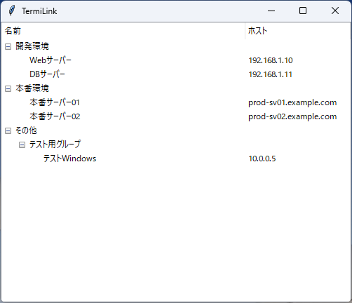

# TermiLink



## 概要

TermiLink は、Windows 向けのシンプルなリモートデスクトップ (RDP) 接続ランチャーです。
接続先サーバーの情報を YAML ファイルで階層的に管理し、GUI のツリービューから簡単に接続を開始できます。

日々のサーバー管理業務などで、多くのサーバーに RDP 接続する必要がある方に最適です。

## 主な機能

*   **接続先のツリー表示**: YAML で定義したグループ構造をそのままツリーで表示します。
*   **YAMLによる設定**: `config.yaml` ファイルで接続先を直感的に管理できます。
*   **簡単接続**: 接続したいサーバーをダブルクリックするだけで RDP 接続を開始します。

## 動作環境

*   **OS**: Windows
*   **Python**: 3.6 以上
*   **ライブラリ**: PyYAML

## 設定方法

アプリケーションと同じディレクトリに `config.yaml` を作成します。以下は設定例です。

```yaml
# config.yaml の例

開発環境:
  - name: Webサーバー
    host: 192.168.1.10
    user: dev_user
  - name: DBサーバー
    host: 192.168.1.11
    user: db_admin

本番環境:
  - name: 本番サーバー01
    host: prod-sv01.example.com
  - name: 本番サーバー02
    host: prod-sv02.example.com

その他:
  - テスト用グループ:
    - name: テストWindows
      host: 10.0.0.5
      user: tester
```

*   **グループ**: `開発環境:` のように、コロンで終わる項目はグループとして扱われます。グループは入れ子にできます。
*   **接続先**: `- name:` で始まる項目が接続先エントリです。
    *   `name`: (必須) ツリーに表示される名前
    *   `host`: (必須) 接続先のホスト名またはIPアドレス
    *   `user`: (任意) 接続に使用するユーザー名。省略した場合は `Administrator` になります。

## ライセンス

このプロジェクトは MIT License の下で公開されています。

## コントリビューション

バグ報告や機能追加の提案は、GitHub の Issues や Pull Requests からお願いします。

